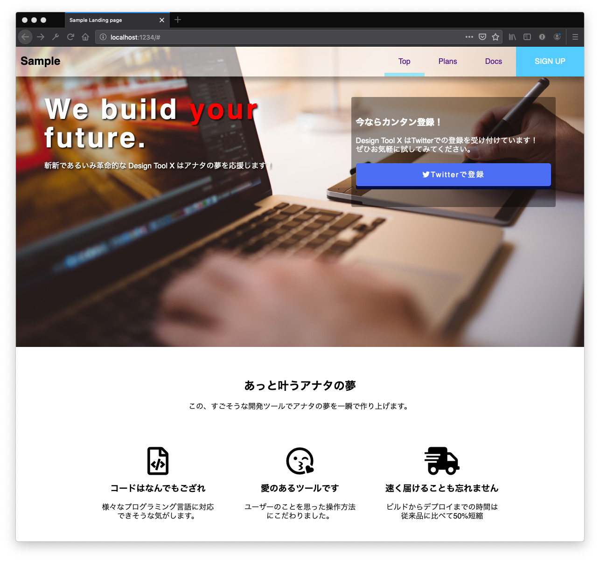
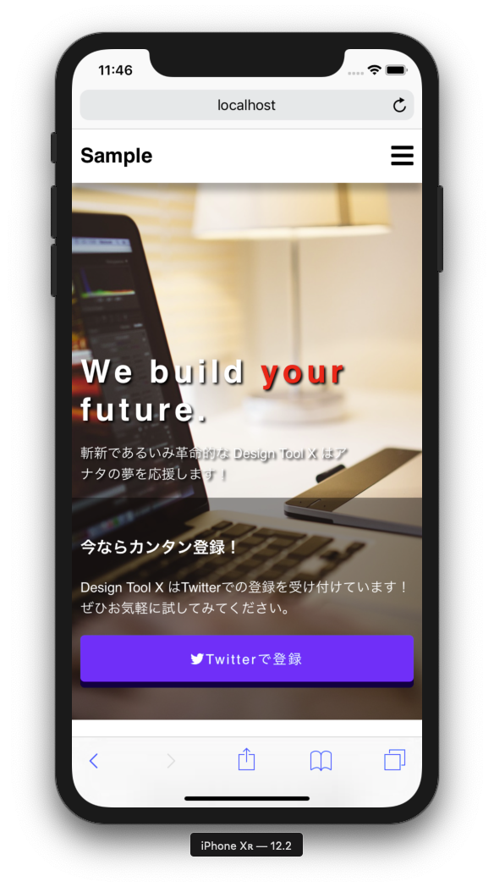

# `#100DaysOfCode` 4. ランディングページ


## このプロジェクトについて

`#100DaysOfCode` の4日目はProgateで学んだことをベースにランディングページのサンプルを作りました。  
Progateでいうとこの知識だけでできると思います。

 - [HTML & CSS 初級編](https://prog-8.com/lessons/html/study/1)
 - [HTML & CSS 中級編](https://prog-8.com/lessons/html/study/2)
 - [HTML & CSS 上級編](https://prog-8.com/lessons/html/study/3)
 - [Sass Ⅰ](https://prog-8.com/lessons/sass/study/1)

**JavaScript(ES6) / jQueryのレッスンをやっていない状態を想定しているので、メニューをクリックしたときの動きはありません。**





### `float: left;` を使っていない箇所があります。

Flexboxが広く使われるようになった今では、Progateで紹介されている `float: left;` で  
要素を横並びにさせるのは古いやり方になりました。  

このプロジェクトでも `float: left` と Flexboxを両方使っています。


### 構造が込み入ってるよ？

Scssが編集されたら自動でコンパイル・反映させたかったのでNode.js(yarn)のプロジェクトになっています。  
**Scssの自動コンパイル(HMR)したかっただけなので、それ以外の要素は含みません。**

次の「ためしかた」を確認してください。


## ためしかた

### Node.jsを使いたくない場合

`src` ディレクトリに **コンパイルする前のScssが保存されています。**  
Scssを取り出してコンパイルし、`src/index.html` をいじってでHTMLで読み込むことで確認できます(方法はわかりますよね？)


また、`dist` ディレクトリに **コンパイルした結果が保存されています。**   
`dist/index.html` を開くとスタイルシートを読み込む記述がありますので、そこからコンパイルされたCSSをたどってください。  

英数字がついていますが今の所気にしないでください。下はCSSを読み込んでいる例なのでファイル名が異なることがあります。

```html
<link rel="stylesheet" href="/app.c328ef1a.css">
```


### 自動コンパイルに挑戦したい場合

#### 1. Node.jsとyarnの環境を用意する

環境構築について書きません。 導入は次の記事が参考になります。
`npx` が必要になりますので、npm 5.2.0 以上が必要です。

nodebrew,npm,yarnなどNode.js関連をざっくり学びながらインストール【初学者向け】 - Qiita: https://qiita.com/nt_tn/items/972a40ee56a67f2a74cb

この環境で動作しています。

```bash
$ sw_vers
ProductName:	Mac OS X
ProductVersion:	10.14.5
BuildVersion:	18F132

$ node -v
v11.4.0

$ npm -v
6.10.0

$ yarn -v
1.12.3
```

#### 2. モジュールを読み込む

```bash
yarn install
```

#### 3. Scssをコンパイルする

`src/index.html` を指定するとHTMLとScssが編集されるたびに自動でコンパイルされるようになります。


```bash
npx parcel ./src/index.html
```


#### 4. `http://localhost:1234/` で確認する

## 背景画像について

<a href="https://pixabay.com/ja/users/Free-Photos-242387/?utm_source=link-attribution&amp;utm_medium=referral&amp;utm_campaign=image&amp;utm_content=768608">Free-Photos</a>による<a href="https://pixabay.com/ja/?utm_source=link-attribution&amp;utm_medium=referral&amp;utm_campaign=image&amp;utm_content=768608">Pixabay</a>からの画像

## 参考

thx!

Sassの変換にオススメ！ Parcel入門 - ICS MEDIA: [https://ics.media/entry/19580/](https://ics.media/entry/19580/)
